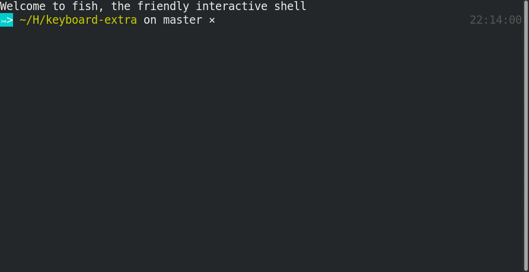

# Elm completions for `fish`

## Features

Full completions for `elm-make`, `elm-package` (including all available package names), `elm-reactor`, `elm-repl` and `elm-test`.

A couple of example journeys:

```fish
> elm-pa[TAB] # elm-package
> elm-package i[TAB] # elm-package install
> elm-package install ev[TAB] # elm-package install evancz/
> elm-package install evancz/[TAB]
[suggestions] evancz/elm-graphics evancz/elm-markdown ...
```

```fish
> elm-rea[TAB] # elm-reactor
> elm-reactor --a[RIGHT ARROW] # elm-reactor --address
> elm-reactor --address=[RIGHT ARROW] # elm-reactor --address=0.0.0.0
```



## Installation

> You need `curl` installed for the interactive package completions.

```sh
$ curl -L https://gist.githubusercontent.com/akabiru/bc0b37a322582d9098bffe2f3316a94e/raw/0c2c80244a4bf68c8e0d89d3f4d2ce4904c64d1e/install_fish_elm_completions.fish | fish
```
